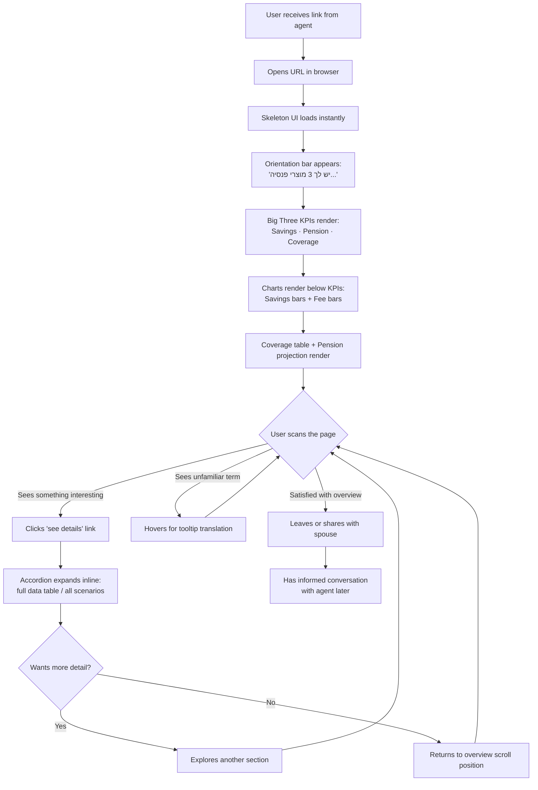
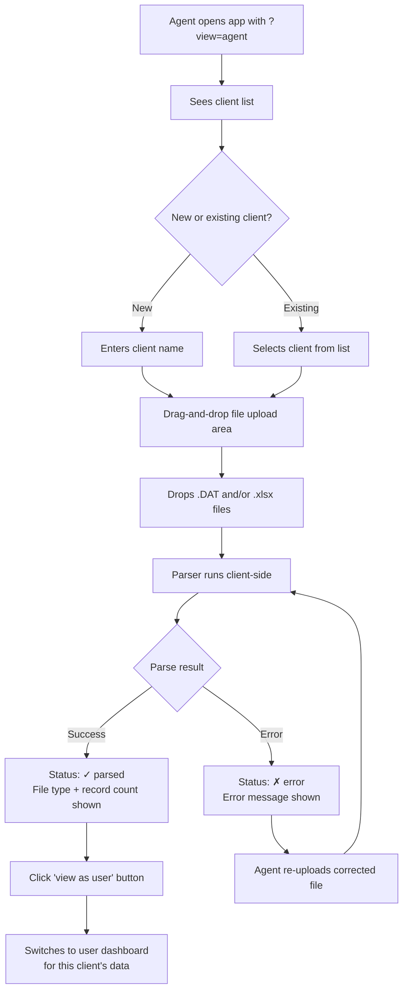
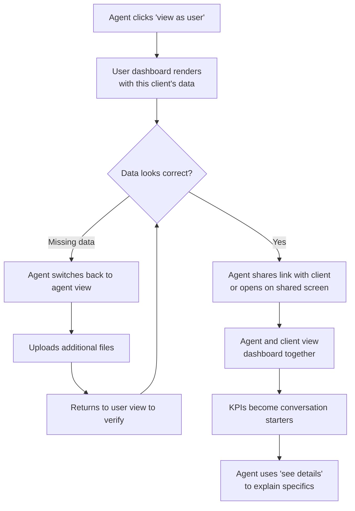

# UX Design Specification InsuranceViewer

**Author:** Ziv04
**Date:** 2026-03-14

---

<!-- UX design content will be appended sequentially through collaborative workflow steps -->

## Executive Summary

### Project Vision

"Upload. See. Understand." — InsuranceViewer is a privacy-first, Hebrew-language (RTL) web application that transforms opaque Israeli government insurance files (Mislaka .DAT and Har Habituach .xlsx) into professional, chart-rich dashboards. All processing happens client-side — zero server storage, no accounts, no credentials shared, no commissions.

The application has two views accessible via a simple toggle (for development/testing purposes only — not a production feature):
- **Agent View:** Minimal file upload and client management interface — functional, not designed
- **User View:** The core product — professional dashboards with rich charts, visual highlights, and clear data presentation

### Target Users

**Primary Persona — End User ("The Confused Saver"):**
- Ages 25-45, multiple scattered insurance/pension/savings products
- Overwhelmed by financial jargon, doesn't understand what they have
- Needs professional, visual dashboards that highlight what matters — fees, coverage, projections, withdrawal eligibility
- Wants to answer: "What do I have? Am I OK? What should I pay attention to?"
- Does NOT upload files — views data prepared by their insurance agent

**Secondary Persona — The Optimizer:**
- Financially literate, wants detailed breakdowns and fee comparisons
- Appreciates chart-rich, data-dense professional presentation

**Agent (Dev/Testing only):**
- Insurance agent who uploads client files
- Simple functional UI — file upload, client list, basic management
- Not a UX priority for this phase

### Key Design Challenges

1. **Professional dashboard UX:** Rich charts, visual hierarchy, and data visualization for complex Israeli financial data — must feel polished and trustworthy, not like a prototype
2. **Hebrew RTL data visualization:** Charts, tables, and numerical data (NIS, percentages, dates) in full RTL layout with proper alignment
3. **Making the complex simple:** Surface actionable highlights (high fees, missing coverage, withdrawal eligibility) through visual cues — not just raw data tables
4. **Information density balance:** Enough depth for the Optimizer, enough clarity for the Confused Saver — progressive disclosure through drill-down
5. **Trust without accounts:** No login means no saved state — the privacy-first approach must be communicated visually throughout

### Design Opportunities

1. **Chart-rich professional dashboards:** Pie charts for allocation, bar charts for fee comparison, line/area charts for projections — making financial data visually intuitive
2. **"Mirror the Mislaka PDF" structure:** Organize sections to match what users already recognize from government reports, reducing cognitive load
3. **Highlight-driven design:** Visual callouts for important items — color-coded fee levels, coverage status indicators, withdrawal eligibility badges
4. **Jargon translation as UX:** Inline plain-Hebrew tooltips for every financial term
5. **Competitive gap:** No Israeli competitor offers instant, zero-conflict, chart-rich visualization of government insurance data

### User Persona Validation

**Focus group reactions to the dashboard concept from both target personas:**

**Dana, 32, "The Confused Saver"** — Marketing manager, has pension and savings from 3 jobs, never looked at her Mislaka report:
- Wants one big total number first — don't make her add things up
- Needs color-coded fee indicators (good/bad) — "is 1.49% green or red?"
- Asks about death/disability coverage — "what happens if?" answered simply
- Wants withdrawal eligibility clearly shown — "can I touch this money yet?"
- Will close the tab if she sees raw field names or unexplained jargon

**Eyal, 41, "The Optimizer"** — Software engineer, reads financial press, tracks his portfolio:
- Wants fee comparison across all products side by side
- Needs investment track performance with allocation breakdown (stocks vs. bonds)
- Expects all 8 pension projection scenarios, not just a range
- Demands access to every data point — progressive disclosure is fine, but nothing hidden

**Progressive Disclosure Strategy (Resolving the Tension):**

| Layer | Audience | Content |
|-------|----------|---------|
| **Layer 1 — Dashboard** | Dana (Confused Saver) | Totals, highlights, color-coded status, simple charts |
| **Layer 2 — Drill-down** | Eyal (Optimizer) | Full data tables, fee comparisons, all projection scenarios, track detail |
| **Layer 3 — Tooltips** | Both | Inline jargon translation on hover — helpful for Dana, ignorable by Eyal |

The dashboard leads with **emotional clarity** (totals, status colors, "you have X products across Y providers") and offers **"see details"** expansion for every section.

### Pre-mortem: UX Risk Analysis

**Identified failure scenarios and preventive design decisions:**

| Risk | Impact | Likelihood | Prevention |
|------|--------|------------|------------|
| **RTL chart rendering bugs** — labels overlap, numbers backwards, % sign misplaced | High | High | Chart library must be RTL-tested exhaustively. Hebrew locale number formatting (₪1,234.56). Validate percentage placement |
| **Data trust breach** — numbers don't match the Mislaka PDF users already have | High | Medium | Match source values exactly, never round differently. Label any derived/calculated numbers as "calculated by InsuranceViewer" |
| **Overwhelming with many products** — works for sample data, breaks with 6+ real products | Medium | High | Design for the heavy case first. Collapsible sections, summary counts, expand/collapse per provider. Stress-test with max realistic data |
| **"Toy" aesthetic** — looks like a startup demo, not a serious financial tool | High | Medium | Professional financial aesthetic — clean, authoritative, muted palette. Reference banking/government tools, not trendy design |
| **Navigation/findability** — users scroll forever looking for their pension data | Medium | Medium | Persistent tab navigation (ביטוח &#x7C; גמל &#x7C; פנסיה &#x7C; הר הביטוח) visible at all times. Never make users hunt for a category |
| **Implied recommendations** — color-coded fees interpreted as financial advice | Medium | Low | Compare to market averages with source attribution, not subjective good/bad. Explicit disclaimer: "this is data, not advice" |

### Scope Clarifications

**User View — Dashboard Sections (organized by user need, not data source):**

Data from multiple file types is blended wherever it serves the user. Sections are organized by "what the user wants to know", not by which XML file it came from.

- **Overview:** The "big picture" KPI dashboard — total savings (₪), projected monthly pension (₪), coverage snapshot (death benefit total, disability yes/no), total annual fees paid (₪), number of products/providers/employers, withdrawal eligibility summary
- **Savings & Investments:** Fund balances, investment track allocation, returns — combined from KGM + relevant PNN data. Use familiar Hebrew terms in headings ("קרן השתלמות" not "מסלול השקעה")
- **Pension & Retirement:** Projected monthly pension as primary number, with all 8 scenarios available in drill-down including assumptions (return rate, salary growth) — from PNN
- **Insurance & Coverage:** Active policies, death/disability coverage, risk insurance — combined from INP + Har Habituach. Coverage highlights also surfaced on Overview
- **Fees:** Management fees across ALL products side by side — combined from KGM, PNN, INP. Show both percentages AND annual NIS cost ("you pay ₪X/year"). Horizontal bar chart comparing all products
- **Deposits & Contributions:** Employee vs employer splits shown inline within each product's detail view. Optional consolidated "all deposits" view for power users

**Agent View (Minimal scope):**
- Client list with names
- File upload per client (drag-and-drop, multiple files)
- Status indicator per file (parsed/error)
- "View as user" button to switch to user dashboard for selected client

**View Toggle:**
- Dev/testing only — implement as URL query parameter (`?view=agent`) or simple top-bar toggle
- Default view: User dashboard
- No authentication required for either view

**Platform:**
- Desktop-first for MVP — charts and data tables optimized for 1024px+
- Basic responsive layout for tablet, but mobile is not a priority

**Empty & Error States:**
- Missing data category: Show section with "no data found" message and explanation of which file type is needed
- Parse error: Show file status with specific error and "try re-uploading" option
- Partial data: Show what's available, indicate what's missing

### Persona-Validated Design Decisions

Based on focus group reactions to the dashboard sections:

1. **Coverage belongs on Overview** — both personas agree death/disability coverage is high-impact and should be visible immediately, not buried in a sub-section
2. **Fees must show NIS amounts** — "you pay ₪X/year" is universally understood; "0.5% דמי ניהול" only helps the Optimizer. Always show both
3. **Use familiar Hebrew terms** — section headings use words users know ("קרן השתלמות", "פנסיה"), technical XML field names only appear in tooltips
4. **Deposits fold into products** — not a standalone section for most users; deposit splits shown inline per product with optional consolidated view
5. **Overview must be KPI-dense** — 6-8 key indicators on one screen: total savings, projected pension, coverage totals, annual fees, product count, withdrawal eligibility

### Information Hierarchy — First Principles

**Core principle:** Lead with answers, not navigation. The user has 30 seconds of attention.

**Visual hierarchy (top to bottom):**

**1. Orientation Bar (always visible)**
Inventory of what was found — "3 pension products, 1 savings fund, 3 policies, 4 providers." Builds trust by confirming the system parsed their data correctly and they recognize their own financial life.

**2. The Big Three (equal weight, primary KPIs)**

| Card | Data | Emotional need |
|------|------|---------------|
| Total Savings | Sum across all products (₪) | Relief / anxiety |
| Monthly Pension | Projected retirement income (₪/month) | Future security |
| Coverage Snapshot | Death benefit total + disability (yes/no) | Family safety |

**3. Action Items (smaller, alert-style cards)**

| Card | Data | Why it's actionable |
|------|------|-------------------|
| Annual Fees | Total fees paid in ₪/year | "Am I getting ripped off?" — drives agent conversations |
| Withdrawal Eligibility | "2 products available for withdrawal" | "Can I access money?" — time-sensitive opportunity |

**4. Drill-down Sections**
Detailed views per category — Savings & Investments, Pension, Insurance & Coverage, Fees Comparison. Accessed via "see details" links from the overview cards, or via persistent section navigation.

**Design principle:** Orientation → Big Three → Action Items → Drill-down. This inverts the typical dashboard pattern (tabs first) by leading with emotional anchors and letting navigation happen naturally through exploration.

### Visualization & Chart Decisions

**Chart Library: Recharts**
- SVG-based, React-native, tree-shakeable (~45KB gzipped)
- Best RTL control via SVG `textAnchor` manipulation
- Print/screenshot friendly (SVG renders natively)

**RTL Strategy:**
- Container `direction: rtl` + SVG `textAnchor='end'` for labels
- Number formatting via `Intl.NumberFormat('he-IL')` throughout
- Don't fight the library — work with SVG primitives for Hebrew text

**Chart Type Map:**

| Section | Chart Type | Notes |
|---------|-----------|-------|
| Overview — Big Three | KPI Cards (no chart) | Numbers are the hero. Charts would distract |
| Savings — Track Allocation | Donut chart | Portfolio split with center total ₪ (custom overlay) |
| Savings — Returns | Horizontal bar chart | Comparing returns across tracks. Horizontal works naturally in RTL |
| Pension — Projections | Range on overview + full table in drill-down | Not an area chart — 8 discrete scenarios, not continuous. Matches Mislaka PDF format |
| Fees — Comparison | Annotated horizontal bar chart | Bars show %, labels show ₪/year. No dual axis (confusing) |
| Insurance — Coverage | Table with status indicators | Coverage amounts per type (death, disability, mortgage) |
| Deposits — History | Sparklines | Lightweight trend lines inline within product cards |

**Technical Constraints:**
- Responsive: set minimum bar heights on tablet, truncate long Hebrew labels with ellipsis + tooltip
- Donut center-label: custom SVG overlay (~20 lines), needs RTL text handling
- Agent print use case: SVG charts render well in print for client presentations

## Core User Experience

### Defining Experience

**The core interaction:** User opens the dashboard and instantly comprehends their financial life. No actions required — no uploads, no configuration, no onboarding. The data is already there (uploaded by their agent). The "wow" moment is the transition from "I have no idea what I have" to "I can see everything clearly" in under 5 seconds.

**The core loop:**
1. User opens dashboard → sees Overview with Big Three KPIs
2. Something catches their eye (a number, a highlight, an alert) → clicks to drill down
3. Drill-down shows full detail with jargon translated inline → user understands
4. User returns to overview or explores another section

There is no "task" — this is a comprehension tool, not a workflow tool. Success is measured by understanding, not by completing actions.

### Platform Strategy

- **Web application** (Next.js) — desktop-first, 1024px+ optimized
- **Mouse/keyboard primary** — hover tooltips, click drill-downs
- **No offline requirement** — data is session-based, no persistence needed
- **No device-specific capabilities** — pure web standards
- **Agent uploads separately** — user view is read-only, all data pre-loaded

### Effortless Interactions

**What should happen automatically (zero user effort):**
- Auto-detect file types from uploaded .DAT/.xlsx files
- Auto-organize data into user-centric sections (not by file type)
- Auto-calculate derived values: total savings, total fees in ₪/year, coverage totals
- Auto-surface highlights: high fees, missing coverage, withdrawal-eligible products
- Auto-translate jargon: every technical term has a plain-Hebrew companion without the user asking for it

**What competitors make painful that we eliminate:**
- No credential sharing (Cover/FINQ require government login)
- No 3-day wait for data (instant parsing)
- No sign-up or account creation
- No subscription or commission pressure
- No black-box AI recommendations to distrust

### Jargon Translation Tiers

Not all jargon is equal. Three tiers of translation ensure clarity without tooltip overload:

| Tier | Strategy | Example |
|------|----------|---------|
| **Tier 1 — Replace entirely** | Code numbers and internal identifiers never shown to users | "סוג מוצר 6" → "ביטוח חיים" |
| **Tier 2 — Simplify + tooltip** | Technical terms rewritten in plain Hebrew, with tooltip for full meaning | "דמי ניהול מצבירה" → "עמלת ניהול חיסכון" (tooltip: "העמלה שהחברה גובה מהכסף שנצבר") |
| **Tier 3 — Tooltip only** | Terms users might recognize, kept as-is with optional explanation | "קרן השתלמות" → kept, tooltip: "חיסכון לטווח בינוני עם הטבת מס" |

The best translation is one the user never notices — Tier 1 terms disappear entirely, Tier 2 terms read naturally, Tier 3 terms are there if you need them.

### Critical Success Moments

**Make-or-break: Jargon comprehension**
The #1 reason users currently fail to understand their insurance data is jargon. If a user sees "דמי ניהול מצבירה 0.10%" and doesn't understand it, the entire tool fails regardless of how beautiful the charts are.

**First-time success moment:** User opens dashboard → sees total savings number → recognizes it as roughly correct → trust established → explores further. If the first number they see feels wrong or incomprehensible, they close the tab.

**Delight moment:** User discovers something they didn't know — coverage amounts, fee totals, withdrawal eligibility — information that was buried in PDFs they never read.

**Handling negative discoveries:** The tool must handle bad news (no coverage, high fees, low pension projection) with neutral presentation. No red alarms or panic-inducing visuals. Present data factually with a gentle contextual hint: "יש לך שאלות? דבר/י עם הסוכן שלך" ("Have questions? Talk to your agent"). This completes the value chain without crossing into recommendations.

### Agent Touchpoint

A subtle but clear "have questions? Talk to your agent" contextual hint — not a CTA button, not a recommendation. A footer note or contextual line that naturally connects comprehension to action. This serves the business model (agents are the paying customers) without compromising the "no recommendations" principle.

### Experience Principles

1. **Comprehension over interaction** — The user's job is to understand, not to do. Every design choice serves clarity
2. **Answers before navigation** — Lead with KPIs and highlights, not with menus and tabs. The dashboard answers questions the user didn't know to ask
3. **Translate everything** — No financial jargon survives without a plain-Hebrew companion. Use the three-tier translation system: replace, simplify, or tooltip
4. **Trust through transparency** — Show source values unmodified. Label calculations. Match the Mislaka PDF numbers exactly. Trust is earned by accuracy, not by branding
5. **Professional, not playful** — This is about people's life savings and family protection. The aesthetic must command respect, not charm
6. **Inform, don't alarm** — The tool reveals reality neutrally. Negative data (high fees, missing coverage) is presented factually, never with panic-inducing visuals. The tool doesn't grade you

## Desired Emotional Response

### Primary Emotional Goals

**The core feeling: "I finally understand."**

InsuranceViewer's emotional purpose is to transform confusion into clarity. The user should feel like someone turned on the lights in a dark room — everything was always there, they just couldn't see it.

| Moment | Target Emotion | Design Driver |
|--------|---------------|---------------|
| Dashboard loads | **Confidence** — "this looks serious and trustworthy" | Professional aesthetic, clean layout, accurate numbers |
| Seeing the Big Three | **Relief** — "I can finally see the full picture" | Single-screen overview, no scrolling required for key facts |
| Discovering coverage | **Empowerment** — "now I know what protects my family" | Coverage snapshot on overview, clear NIS amounts |
| Seeing fees | **Informed awareness** — "I know what I'm paying now" | Neutral presentation with NIS/year, no judgment |
| Exploring drill-downs | **Control** — "I can go as deep as I want" | Progressive disclosure, everything accessible |
| Returning to overview | **Orientation** — "I always know where I am" | Persistent nav, clear back paths |

### Emotional Journey Map

**First open:** Curiosity → Recognition → Trust → Relief
"what's this?" → "I see my data" → "numbers look right" → "I get it"

**Exploration:** Interest → Understanding → Empowerment
"what's this section?" → "oh, that's what it means" → "now I know"

**Bad news:** Surprise → Calm awareness → Motivation
"I have no disability coverage?" → "ok, noted" → "I'll ask my agent"

**Leaving:** Satisfaction → Retained knowledge
"I understand my situation now" → tells spouse/friend what they learned

### Shared Viewing Context

Most users will first see this dashboard while sitting across from their insurance agent. The emotional context includes:
- User is already somewhat anxious (meeting about finances)
- Agent is presenting (needs the tool to make them look competent)
- Both are looking at the same screen

The dashboard's emotional tone serves a **conversation between two people**. The Big Three KPIs become conversation starters. The drill-downs become "let me show you this" moments. The tool facilitates dialogue, not replaces it.

### Micro-Emotions

**Critical emotional states to cultivate:**

- **Trust over skepticism** — The first number must feel right. Professional aesthetic, exact source values, no "magic" calculations without explanation
- **Confidence over confusion** — Every term is understandable (three-tier jargon system). The user never feels stupid
- **Calm awareness over anxiety** — Even negative findings (high fees, no coverage) are presented neutrally. The tool informs, never alarms
- **Control over helplessness** — The user can explore any direction, go deep or stay high-level. Nothing is hidden, nothing is forced

**Emotions to actively prevent:**
- **Overwhelm** — too much data at once (solved by progressive disclosure)
- **Distrust** — numbers that don't match their existing knowledge (solved by exact source values)
- **Shame** — feeling judged for having high fees or low savings (solved by neutral presentation, no grading)
- **Dependency** — feeling they need the tool to make decisions (solved by no recommendations, just data)

### Warm Micro-Copy

Professional warmth through language, not design gimmicks:

| Pattern | Cold (avoid) | Warm (use) |
|---------|-------------|-----------|
| Orientation | "נמצאו 3 מוצרי פנסיה" | "יש לך 3 מוצרי פנסיה" |
| Empty state | "לא נמצאו נתונים" | "לא קיבלנו קובץ פנסיה עדיין" |
| Error | "שגיאה בקריאת הקובץ" | "לא הצלחנו לקרוא את הקובץ — נסה להעלות שוב" |
| Fees | "דמי ניהול: 1.49%" | "את/ה משלם/ת ₪1,240 בשנה על ניהול" |

First-person possessive Hebrew ("יש לך", "שלך") — the data belongs to the user, the language reflects that.

### Loading Experience

For a tool that promises instant comprehension, even 1 second of blank screen breaks the emotional promise:

- **Skeleton UI** — shows layout structure immediately (card shapes, chart placeholders)
- **Progressive rendering** — KPI numbers appear first (fastest to calculate), charts render after
- **No loading spinners** — spinners signal "wait"; skeleton UI signals "almost there"
- The feeling of speed is as important as actual speed

### Design Implications

| Emotional Goal | UX Decision |
|---------------|-------------|
| Trust | Professional color palette (deep blues, muted tones), exact numbers from source, "data from your files" attribution |
| Relief | Big Three KPIs visible without scrolling, single-screen overview |
| Confidence | Three-tier jargon translation, familiar Hebrew terms, tooltips everywhere |
| Calm awareness | No red/green judgment colors for fees. Neutral color palette for data. Amber only for genuinely missing data |
| Control | Persistent navigation, clear drill-down paths, expandable sections, nothing hidden |
| Empowerment | Coverage and fees surfaced proactively — information the user didn't know to look for |
| Warmth | First-person possessive micro-copy, helpful empty states, conversational tone |

### Emotional Design Principles

1. **Clarity is the emotion** — The feeling of understanding IS the product's emotional payoff. Every pixel serves comprehension
2. **Respect the weight** — This is life savings, family protection, retirement security. The design must honor the gravity of the data
3. **Neutral is not cold** — Present data without judgment but with warmth through micro-copy. Professional and human, not clinical and sterile
4. **No emotional manipulation** — No gamification, no urgency, no fear-based alerts. Pure information, respectfully presented
5. **The agent completes the emotional loop** — The tool creates understanding; the agent creates action. "Have questions? Talk to your agent" is the natural emotional exit
6. **Design for two viewers** — The dashboard is often a shared screen between agent and client. KPIs start conversations, drill-downs are "let me show you" moments

## UX Pattern Analysis & Inspiration

### Inspiring Products Analysis

**1. Cover (קאבר) — Israeli Insurance Aggregation App**

Cover's core UX strength is consolidating a fragmented landscape — pension, insurance, and savings — into a single dashboard. With 300,000+ users, they've validated that Israeli consumers want to see everything in one place rather than juggling government portals.

- **What they do well:** Centralized aggregation of all pension/insurance data into a unified view; cost analysis with fee breakdowns; duplicate coverage detection; clear service flow (signup → data pull → analysis → recommendations)
- **What makes it compelling:** Zero-cost entry removes friction entirely; the "aha moment" comes when users see their scattered financial products consolidated for the first time
- **What keeps users returning:** Ongoing optimization suggestions and fee monitoring create a reason to check back

**2. Bank Hapoalim (בנק הפועלים) — Israeli Banking App**

Hapoalim's app is the gold standard for RTL financial UX in Israel. Their design system demonstrates how to present complex financial data to Hebrew-speaking users in a way that feels premium and trustworthy.

- **What they do well:** Gray-toned primary palette conveys institutional trust; custom 3-language font ensures consistent typographic hierarchy; account balance displayed prominently as the anchor element; smart analysis/prediction features add value beyond raw data
- **What makes it compelling:** Summary-to-drill-down navigation — users see the big picture first, then tap to explore details; progressive disclosure prevents information overload
- **What keeps users returning:** Clean, symmetrical layout creates a distinctive visual identity; skeleton UI during loading maintains spatial orientation

### Transferable UX Patterns

**Navigation Patterns:**
- **Summary → Drill-down** (Hapoalim) — perfect for our Dashboard → Section → Detail flow. Users see KPIs first, tap for specifics
- **Single consolidated view** (Cover) — validates blending data from multiple file types into user-centric sections rather than source-based tabs

**Interaction Patterns:**
- **Progressive disclosure** (both apps) — aligns with our 3-layer system: Dashboard → Drill-down → Tooltips
- **Prominent balance/KPI anchoring** (Hapoalim) — supports our "Big Three" KPIs at the top of the dashboard
- **Skeleton UI loading** (Hapoalim) — matches our "numbers first, charts after, no spinners" loading strategy

**Visual Patterns:**
- **Muted, trust-building palette** (Hapoalim's gray tones) — our navy #1e3a5f + teal #0d9488 achieves similar institutional trust with more warmth
- **Custom Hebrew typography** (Hapoalim) — validates investing in proper Hebrew font pairing (Assistant/Heebo); font consistency across Hebrew and numbers is critical for RTL financial data
- **Clean spatial hierarchy** (both apps) — generous whitespace and clear section boundaries prevent the "wall of numbers" problem

### SCAMPER-Enhanced Patterns

**Subtle Semantic Color Coding (SCAMPER: Substitute)**
Replace flat neutral card backgrounds with very subtle status-tinted surfaces. A soft green-tinted background on a healthy coverage card, a gentle warm amber border on above-average fees. The user should feel the status before consciously reading it. Restraint is critical — if it looks like a warning dashboard, trust breaks. Think Hapoalim-level calm, not traffic lights.

**KPI + Jargon Fusion Cards (SCAMPER: Combine)**
Every Big Three KPI card combines the number with a plain-Hebrew sentence. Not "סה״כ כיסוי: ₪2,100,000" but "יש לך ביטוח חיים שמכסה 2.1 מיליון ₪". The number IS the explanation. No cognitive gap between data and meaning at the top-level view.

### Anti-Patterns to Avoid

- **Commission-driven bias in presentation** (Cover criticism) — present data objectively, never "steer" users. Our zero-commission positioning must be reflected in UX
- **3-day data lag frustration** (Cover/Clearinghouse) — we avoid this with instant client-side parsing; make the "instant results" advantage obvious in UX
- **Raw government data tables** (Insurance Mountain/Pension Net) — never present raw tables without context, translation, or visual support
- **Jargon-heavy interfaces** (all government financial tools) — validated by our 3-tier jargon translation system
- **Information overload on first view** — both Cover and Hapoalim succeed by limiting what's shown initially; resist showing everything at once

### Design Inspiration Strategy

**What to Adopt:**
- Hapoalim's summary-to-drill-down navigation — maps directly to our information hierarchy (Orientation → Big Three → Action Items → Drill-down)
- Cover's consolidated single-view approach — validates blending Mislaka and Har Habituach data into unified user-centric sections
- Hapoalim's skeleton UI loading pattern — aligns with our progressive rendering strategy

**What to Adapt:**
- Hapoalim's gray palette → our warmer navy/teal with subtle semantic color tinting for status communication
- Cover's fee comparison → visual charts (donut for allocation, bar for comparison) with plain-Hebrew KPI fusion labels
- Hapoalim's custom font system → our Assistant/Heebo pairing with consistent Hebrew numeral display across all chart labels

**What to Avoid:**
- Cover's commission-driven recommendation patterns — conflicts with zero-conflict positioning
- Government portal raw-data-dump approach — conflicts with "understand at a glance" principle
- Complex onboarding flows — our agent-upload model eliminates this entirely for end users
- Sloppy or aggressive color coding — trust is the key factor; subtlety over impact

## Design System Foundation

### Design System Choice

**Tailwind CSS + shadcn/ui** — A utility-first CSS framework paired with a copy-paste component library that gives full ownership of every component.

### Rationale for Selection

1. **Full RTL control** — Tailwind's logical properties (`ps-`, `pe-`, `ms-`, `me-`) and `dir="rtl"` support make Hebrew layout natural. No fighting a component library's built-in LTR assumptions
2. **Own the code** — shadcn/ui components are copied into the project, not imported from `node_modules`. Every component can be tweaked for Hebrew typography, semantic color tinting, and Recharts integration without forking a library
3. **CSS variable theming** — Navy/teal palette, subtle semantic status colors, and Hapoalim-inspired restraint are all configurable through CSS custom properties in a single `globals.css`
4. **Zero bloat** — Only install the components actually needed (Card, Table, Tooltip, Accordion, Skeleton, Badge). Dashboard apps don't need modals, date pickers, or form wizards
5. **Next.js native** — Both Tailwind and shadcn/ui are first-class citizens in the Next.js ecosystem. Zero configuration friction
6. **Accessible by default** — shadcn/ui builds on Radix UI primitives with ARIA attributes, keyboard navigation, and focus management baked in

### Implementation Approach

**Component Selection (what we actually need):**

| Component | Use Case |
|-----------|----------|
| **Card** | KPI cards, section containers, product summaries |
| **Table** | Drill-down data tables (fees, coverage, deposits) |
| **Tooltip** | Jargon translation (Tier 2 & 3), chart data points |
| **Accordion** | Expandable drill-down sections, product detail views |
| **Skeleton** | Loading states — card shapes and chart placeholders |
| **Badge** | Status indicators (withdrawal eligible, coverage active) |
| **Tabs** | Section navigation (if needed beyond scroll) |

**Not needed for MVP:** Dialog, Sheet, Form, Select, Dropdown, Toast, Calendar, Command

### Customization Strategy

**Design Tokens (CSS Variables):**

```
--primary: navy #1e3a5f (headers, nav, primary text)
--secondary: teal #0d9488 (accents, links, interactive elements)
--background: #fafafa (clean, light canvas)
--card: #ffffff (card surfaces)
--status-healthy: subtle green tint (opacity ~0.05 on card bg)
--status-attention: subtle amber tint (opacity ~0.05 on border)
--status-neutral: no tint (default)
```

**Typography:**
- Headings: Assistant (Hebrew-optimized, professional weight)
- Body: Heebo (clean Hebrew body text, excellent numeral rendering)
- Numbers in charts: Heebo with `font-variant-numeric: tabular-nums` for aligned columns

**RTL Customization:**
- Global `dir="rtl"` on `<html>` element
- Tailwind logical properties throughout (no `left`/`right`, only `start`/`end`)
- Chart containers inherit RTL direction; SVG text uses `textAnchor="end"`

**Semantic Color Application:**
- Applied via Tailwind utilities: `bg-status-healthy/5`, `border-status-attention/10`
- Restrained by design — only on cards where status adds genuine information value
- Never on text — only on backgrounds and borders at very low opacity

## Defining Core Experience

### Defining Experience

**"Open and instantly understand your entire financial picture."**

The InsuranceViewer experience in one sentence a user would tell a friend: *"I could see everything in one place, instantly."*

This is not a tool you "use" — it's a window you look through. There is no core action, no button to press, no workflow to complete. The defining experience is **comprehension on arrival**. The dashboard loads, and within 5 seconds the user knows more about their financial life than they learned from years of unopened Mislaka PDFs.

### User Mental Model

**What we're replacing:** The Mislaka PDF — a dense, jargon-heavy government report that most users receive, glance at, and file away without understanding. The PDF is comprehensive but incomprehensible to non-experts.

**What we are:** The translated, summarized version of that PDF. Not a replacement — a translation layer. The source data is the same government data the user already "has." We make it legible.

**Mental model shift:**
- **Before:** "I have insurance and pension stuff somewhere, I think it's fine"
- **After:** "I have 3 pension products, my total savings are ₪450K, I pay ₪3,200/year in fees, and I have disability coverage"

**Key implication:** Users don't come to InsuranceViewer to "do" something. They come to finally *see* what they already have. The mental model is a mirror, not a tool.

### Success Criteria

**The 5-second test:** Dashboard loads → user's eye goes to the numbers first. Big, bold ₪ amounts in the KPI fusion cards. The number IS the summary — "יש לך חיסכון של 450,000 ₪" reads as a sentence, but the eye catches ₪450,000 first.

**Success indicators:**
1. **Recognition** — User sees total savings and thinks "yeah, that sounds about right." Trust established
2. **Discovery** — User learns something they didn't know: a coverage amount, a fee total, a withdrawal eligibility. The "aha" moment
3. **Shareability** — User can explain their financial situation to a spouse/friend in plain language after one viewing
4. **Agent conversation** — The dashboard becomes the conversation anchor when the user next speaks with their insurance agent

**Failure indicator:** User looks at the dashboard and says "I don't understand what I'm looking at" — means jargon leaked through, numbers aren't prominent enough, or layout is too complex.

### Novel UX Patterns

**Mostly established patterns, one key innovation:**

**Established (adopt directly):**
- KPI card dashboard — proven in every analytics/banking app
- Progressive disclosure / drill-down — standard pattern, well understood
- Tooltip-based glossary — familiar hover/tap pattern
- Skeleton loading — users know what this means

**The innovation — KPI Fusion Cards:**
Combining the number with a plain-Hebrew sentence is not standard. Most dashboards show a label + number ("Total Savings: ₪450,000"). We show a sentence with the number embedded ("יש לך חיסכון של 450,000 ₪"). This is a subtle but meaningful departure — the card reads as natural language, not as a data field. No user education needed; it just reads naturally.

**No novel navigation or interaction patterns.** Users shouldn't need to learn anything new. The innovation is in the content layer (translation, summarization, fusion), not in the interaction layer.

### Experience Mechanics

**1. Initiation:**
- User receives a link from their insurance agent (or opens a bookmarked URL)
- Dashboard loads immediately — no login, no onboarding, no splash screen
- Skeleton UI appears instantly, numbers fill in within 1-2 seconds

**2. First View (the defining 5 seconds):**
- Orientation bar confirms data is loaded: "יש לך 3 מוצרי פנסיה, קרן השתלמות, ו-3 פוליסות ביטוח"
- Big Three KPI fusion cards are the visual anchor — total savings, monthly pension, coverage snapshot
- Eye naturally scans the numbers (largest text on screen), then reads the surrounding Hebrew sentence for context
- Subtle semantic color tinting on cards provides subconscious status (healthy/attention) without demanding cognitive effort

**3. Exploration (user-driven, not guided):**
- Action item cards below Big Three surface fees and withdrawal eligibility
- "See details" links on each card lead to drill-down sections
- Drill-downs show full data tables, charts, and per-product breakdowns
- Tooltips on any underlined term provide Tier 2/3 jargon translation
- User can go as deep as they want or stay on the overview — both are complete experiences

**4. Completion:**
- There is no "done" state — the dashboard is a reference, not a task
- User leaves when they've seen enough
- The residual value: user now understands their financial situation and can have an informed conversation with their agent

## Visual Design Foundation

### Color System

**Core Palette:**

| Token | Value | Usage |
|-------|-------|-------|
| `--primary` | `#1e3a5f` (Navy) | Headers, navigation bar, primary text, section titles |
| `--primary-foreground` | `#ffffff` | Text on primary backgrounds |
| `--secondary` | `#0d9488` (Teal) | Accents, interactive links, "see details" CTAs, chart highlights |
| `--secondary-foreground` | `#ffffff` | Text on secondary backgrounds |
| `--background` | `#fafafa` | Page canvas |
| `--card` | `#ffffff` | Card surfaces, content containers |
| `--card-foreground` | `#1e293b` (Slate 800) | Body text on cards |
| `--muted` | `#f1f5f9` (Slate 100) | Subtle backgrounds, table alternating rows |
| `--muted-foreground` | `#64748b` (Slate 500) | Secondary text, labels, timestamps |
| `--border` | `#e2e8f0` (Slate 200) | Card borders, dividers, table lines |

**Semantic Status Colors (subtle application only):**

| Token | Value | Usage | Application |
|-------|-------|-------|-------------|
| `--status-healthy` | `#10b981` (Emerald 500) | Active coverage, good standing | `bg-emerald-500/5` on card background |
| `--status-attention` | `#f59e0b` (Amber 500) | Above-average fees, expiring items | `border-amber-500/10` on card border |
| `--status-missing` | `#94a3b8` (Slate 400) | No data available, empty sections | Muted text + dashed border |
| `--status-info` | `#0d9488` (Teal — same as secondary) | Withdrawal eligible, actionable items | Badge background |

**Rules:** Status colors never appear on text. Only on card backgrounds (5% opacity) and borders (10% opacity). If a card has no meaningful status, it stays neutral white. The default state is calm.

**Chart Colors:**

| Purpose | Color | Notes |
|---------|-------|-------|
| Primary data series | `#1e3a5f` (Navy) | Dominant chart element |
| Secondary series | `#0d9488` (Teal) | Comparison/secondary data |
| Tertiary series | `#64748b` (Slate 500) | Third data point if needed |
| Quaternary series | `#94a3b8` (Slate 400) | Fourth data point |
| Highlight/selected | `#0d9488` at full opacity | Active/hover state on chart elements |

Chart palette limited to 4 colors max. If more are needed, use opacity variations of navy/teal rather than introducing new hues.

### Typography System

**Font Stack:**

| Role | Font | Weight | Fallback |
|------|------|--------|----------|
| Headings (h1-h3) | Assistant | 600 (SemiBold), 700 (Bold) | system-ui, sans-serif |
| Body text | Heebo | 400 (Regular), 500 (Medium) | system-ui, sans-serif |
| KPI numbers | Heebo | 700 (Bold) | system-ui, sans-serif |
| Chart labels | Heebo | 400 (Regular) | system-ui, sans-serif |

**Type Scale (based on 16px root):**

| Level | Size | Weight | Line Height | Usage |
|-------|------|--------|-------------|-------|
| KPI Number | 36px / 2.25rem | Bold 700 | 1.1 | Big Three ₪ amounts |
| h1 | 28px / 1.75rem | SemiBold 600 | 1.3 | Page title ("הסקירה הפיננסית שלך") |
| h2 | 22px / 1.375rem | SemiBold 600 | 1.3 | Section headers (חסכונות והשקעות) |
| h3 | 18px / 1.125rem | Medium 500 | 1.4 | Card titles, subsection headers |
| Body | 16px / 1rem | Regular 400 | 1.5 | Fusion card sentences, descriptions |
| Small | 14px / 0.875rem | Regular 400 | 1.5 | Table data, chart labels, tooltips |
| Caption | 12px / 0.75rem | Regular 400 | 1.4 | Timestamps, source attribution, disclaimers |

**Numeral Handling:**
- `font-variant-numeric: tabular-nums` on all data tables and chart labels — ensures ₪ amounts align vertically
- Numbers always formatted via `Intl.NumberFormat('he-IL')` — produces `₪1,234.56` with correct grouping
- Percentage sign placement: `1.49%` (number first, then %) — standard in Hebrew financial context

### Spacing & Layout Foundation

**Base Unit:** 4px

**Spacing Scale:**

| Token | Value | Usage |
|-------|-------|-------|
| `xs` | 4px | Inline spacing, icon gaps |
| `sm` | 8px | Tight element spacing, badge padding |
| `md` | 16px | Card internal padding, between form elements |
| `lg` | 24px | Between cards, section spacing |
| `xl` | 32px | Between major sections |
| `2xl` | 48px | Page-level section separation |

**Layout Grid:**
- Max content width: `1280px` (centered)
- Card grid: CSS Grid with `auto-fill, minmax(320px, 1fr)` — naturally responsive
- Big Three KPIs: 3-column equal grid on desktop, stack on tablet
- Drill-down sections: single column, full width within content area
- Gutter: `24px` (lg) between grid items

**Card Anatomy:**
- Padding: `24px` (lg) all sides
- Border radius: `8px`
- Border: `1px solid var(--border)` — subtle, not heavy
- Shadow: `0 1px 3px rgba(0,0,0,0.05)` — barely visible, just enough depth
- Hover: no change (cards are not clickable containers — links inside them are)

**RTL Layout Rules:**
- All padding/margin uses logical properties (`ps`, `pe`, `ms`, `me`)
- Text alignment: `text-start` (not `text-right`)
- Flex direction: natural (RTL reverses automatically)
- No `left`/`right` in any CSS — only `start`/`end`/`inline-start`/`inline-end`

### Accessibility Considerations

**Contrast Ratios (WCAG AA minimum):**

| Combination | Ratio | Status |
|-------------|-------|--------|
| Navy `#1e3a5f` on White `#ffffff` | 9.4:1 | Passes AAA |
| Teal `#0d9488` on White `#ffffff` | 4.6:1 | Passes AA |
| Slate 800 `#1e293b` on White `#ffffff` | 12.6:1 | Passes AAA |
| Slate 500 `#64748b` on White `#ffffff` | 4.6:1 | Passes AA |
| White on Navy `#1e3a5f` | 9.4:1 | Passes AAA |

**Semantic status colors are never used for text** — they appear at 5-10% opacity on backgrounds/borders only, so contrast is not affected.

**Additional accessibility:**
- Focus rings: `2px solid var(--secondary)` with `2px offset` — visible on all interactive elements
- Touch targets: minimum 44x44px for all clickable elements
- Tooltips: triggered by both hover and focus (keyboard accessible)
- Screen reader: all chart data available as accessible table alternative
- `prefers-reduced-motion`: disable skeleton pulse animation, use instant-show instead
- `prefers-contrast`: increase border opacity from 10% to 30% for status indicators

## Design Direction Decision

### Design Directions Explored

Four design directions were generated and presented as an interactive HTML showcase ([ux-design-directions.html](ux-design-directions.html)):

- **A: Tabbed Sections** — Big Three KPIs always visible, category tabs below (Savings/Pension/Insurance/Fees) with drill-down content in each tab
- **B: Tabbed Compact** — Condensed KPI strip + overview tab with action items, plus category tabs
- **C: Story Scroll** — Narrative chapters with generous spacing: "מה יש לך → כמה זה עולה → מה מגן עליך → העתיד שלך"
- **D: Story Dense** — Single page with all data visible, side-by-side chart pairs, no chapter divisions. Compact KPI row at top, then paired chart sections below

### Chosen Direction

**Direction D: Story Dense** — a single-page financial overview that presents everything without chapter breaks or tab switching.

**Key characteristics:**
- Big Three KPIs in a compact 3-column row at the top
- Side-by-side chart pairs: savings breakdown + fee comparison, coverage table + pension projection
- No tabs, no chapters, no pagination — one continuous, dense page
- "See details" links for drill-down into full data tables (pension scenarios, product-level detail)
- All critical information visible without scrolling past the first viewport (KPIs) or without more than one scroll (everything else)

### Design Rationale

1. **Matches the "mirror" mental model** — Users come to see their whole picture at once. Direction D delivers that literally — everything is on one page
2. **Optimized for the shared viewing context** — Agent and user sitting together can scan the whole page without navigating tabs or scrolling through chapters. Points of interest are all visible
3. **Maximizes the "aha moment"** — The density itself communicates comprehensiveness. "Look at all this data about you, organized and clear" — the volume of understood information is the payoff
4. **Supports both personas** — Dana (Confused Saver) sees KPIs and charts at a glance. Eyal (Optimizer) sees data density and "see details" links for deeper drill-down. Neither needs to navigate
5. **Simpler implementation** — No tab state management, no routing within the dashboard. One page, render everything. Faster to build, fewer edge cases

### Implementation Approach

**Layout structure:**

```
┌─────────────────────────────────────────┐
│ Nav Bar (InsuranceViewer + date)        │
├─────────────────────────────────────────┤
│ Orientation Bar                         │
├─────────────────────────────────────────┤
│ ┌───────────┐ ┌───────────┐ ┌─────────┐│
│ │ KPI: Save │ │ KPI: Pens │ │KPI: Cov ││
│ └───────────┘ └───────────┘ └─────────┘│
├────────────────────┬────────────────────┤
│ Chart: Savings     │ Chart: Fees        │
│ (bar by product)   │ (bar + total)      │
├────────────────────┼────────────────────┤
│ Table: Coverage    │ KPI: Pension       │
│ (status badges)    │ (range + link)     │
├────────────────────┴────────────────────┤
│ Agent footer                            │
└─────────────────────────────────────────┘
```

**Drill-down strategy:** "See details" links on KPI cards and chart sections expand inline (accordion-style) or navigate to a detail view below the fold. No new pages, no modals — keep the user on the same surface.

**Responsive behavior:** On tablet (< 1024px), chart pairs stack vertically. KPI row stays 3-column down to 768px, then stacks. The page becomes a longer scroll but maintains the same information hierarchy.

## User Journey Flows

### Journey 1: End User — "See My Financial Picture"

**The core journey.** User opens the dashboard and comprehends their financial life.



**Key moments:**
- **0-1s:** Skeleton UI — spatial orientation established
- **1-2s:** KPI numbers appear — the "aha" moment begins
- **2-3s:** Charts render — full picture emerges
- **3-5s:** User has scanned Big Three, knows their total savings, pension, and coverage
- **5s+:** Exploration phase — self-directed, no guidance needed

**Error states:**
- Missing file type → section shows "לא קיבלנו קובץ פנסיה עדיין" with explanation of which file is needed
- Parse error → "לא הצלחנו לקרוא את הקובץ — נסה להעלות שוב" with file name
- Partial data → available sections render normally, missing sections show empty state

### Journey 2: Agent — "Upload Client Files"

**Minimal functional flow.** Agent uploads files, sees status, previews user view.



**Agent view components (minimal):**
- Client list (simple list with names)
- File upload zone (drag-and-drop, accepts .DAT and .xlsx)
- Per-file status badges (parsed/error)
- "View as user" button per client

### Journey 3: Agent-to-User Handoff — "Review Before Sharing"

**Quick verification flow.** Agent checks the user view before sharing with client.



### Journey Patterns

**Patterns consistent across all journeys:**

1. **Zero-auth entry** — No journey requires login, account creation, or credential sharing. URLs are the access mechanism
2. **Progressive rendering** — Every journey starts with skeleton → numbers → charts. No blank screens, no loading spinners
3. **Inline expansion** — Drill-downs happen on the same page via accordion, never via navigation to a new page
4. **Self-recovery** — Errors show what happened and what to do next in plain Hebrew. No dead ends
5. **Warm micro-copy throughout** — First-person possessive ("יש לך", "שלך") in user view; functional language in agent view

### Flow Optimization Principles

1. **Minimize time to first number** — The first ₪ amount must appear within 2 seconds of page load. Everything else can follow
2. **No mandatory interactions** — The user view requires zero clicks to be useful. Exploration is optional, not required
3. **Agent view is a stepping stone** — The agent spends minimum time here. Upload → verify → share. No dashboard analytics for agents
4. **Shared screen optimization** — The dense single-page layout means agent and client see the same thing without scrolling or navigating during a conversation
5. **Data freshness transparency** — "נתונים מתאריך 15.03.2026" always visible in nav bar. User always knows how current their data is

## Component Strategy

### Design System Components (shadcn/ui)

| Component | Customization Needed |
|-----------|---------------------|
| **Card** | Add semantic color tinting variants (healthy/attention/missing) via className props |
| **Table** | RTL text alignment, `tabular-nums`, alternating row backgrounds |
| **Tooltip** | Wider max-width for Hebrew jargon explanations (~300px), RTL positioning |
| **Accordion** | Smooth expand animation, "see details ←" trigger styling |
| **Skeleton** | Card-shaped and chart-shaped variants matching Direction D layout |
| **Badge** | Status variants: `teal` (active/eligible), `amber` (attention/missing), `green` (healthy) |

### Custom Components

**1. KPI Fusion Card**

- **Purpose:** Display a Big Three KPI with number + plain-Hebrew sentence as one unit
- **Anatomy:** Large number (36px bold) + sentence (16px body) + optional "see details ←" link + optional semantic card tint
- **Props:** `value: string`, `sentence: string`, `status?: 'healthy' | 'attention' | 'neutral'`, `detailsLink?: string`
- **States:** Default (neutral bg), healthy (green tint), attention (amber border), loading (skeleton)
- **Accessibility:** `aria-label` combines sentence + value for screen readers
- **Example:** `<KpiFusionCard value="₪452,340" sentence="יש לך חיסכון כולל של 452,340 ₪" status="healthy" />`

**2. Orientation Bar**

- **Purpose:** Confirm data inventory — "יש לך X מוצרים, Y ספקים, Z מעסיקים"
- **Anatomy:** Inline text with bold counts, muted background strip below nav
- **Props:** `products: number`, `providers: number`, `employers: number`, `fileTypes: string[]`
- **States:** Loaded (shows counts), partial (shows what's available + what's missing)
- **Accessibility:** `role="status"`, `aria-live="polite"` — announces when data loads

**3. Fee Comparison Bar**

- **Purpose:** Horizontal bar chart row showing product name, fee %, and annual ₪ cost
- **Anatomy:** Label (product name) + bar track + bar fill (proportional width) + value overlay (% · ₪/year)
- **Props:** `label: string`, `percentage: number`, `annualCost: number`, `isHighlighted?: boolean`
- **States:** Default (navy/teal fill), attention (amber fill for above-average fees)
- **Note:** Built with Recharts `BarChart` with custom label renderer, not a standalone div-based component

**4. Coverage Status Row**

- **Purpose:** Table row showing coverage type, amount, provider, and status badge
- **Anatomy:** 4-column table row with Badge component for status
- **Props:** `coverageType: string`, `amount: string`, `provider: string`, `status: 'active' | 'missing' | 'expired'`
- **States:** Active (green badge), missing (amber badge + "חסר"), expired (muted text)

**5. Product Summary Card**

- **Purpose:** Compact card for a single financial product in drill-down sections
- **Anatomy:** Product name + provider + 3-stat grid (balance, return, status) + optional badge
- **Props:** `name: string`, `provider: string`, `stats: StatItem[]`, `badge?: BadgeProps`
- **States:** Default, with withdrawal badge, loading (skeleton)

**6. Agent File Upload Zone**

- **Purpose:** Drag-and-drop file upload area for agent view
- **Anatomy:** Dashed border area + icon + instruction text + file list with status badges
- **Props:** `onFilesDropped: (files: File[]) => void`, `uploadedFiles: FileStatus[]`
- **States:** Empty (dashed border + "גרור קבצים לכאן"), hover (border highlight), files uploaded (list with ✓/✗)
- **Note:** Minimal styling — functional, not designed. Uses native drag-and-drop API

**7. Agent Footer**

- **Purpose:** Subtle footer with "talk to your agent" hint and data disclaimer
- **Anatomy:** Centered text line with muted styling, border-top separator
- **Content:** "יש לך שאלות? דבר/י עם הסוכן שלך · המידע מבוסס על קבצים שהועלו ואינו מהווה ייעוץ פיננסי"
- **Note:** Static component, no interactivity

### Component Implementation Strategy

**Build order (by journey criticality):**

**Phase 1 — Core Dashboard (Journey 1):**
1. KPI Fusion Card — the defining component, build first
2. Orientation Bar — first thing users see after nav
3. Fee Comparison Bar (Recharts) — key chart in the dense layout
4. Coverage Status Row — table within the coverage chart area
5. Agent Footer — static, quick to build

**Phase 2 — Drill-down (Journey 1 expansion):**
6. Product Summary Card — used in accordion drill-downs
7. Accordion customization — "see details" trigger + smooth animation

**Phase 3 — Agent View (Journey 2):**
8. Agent File Upload Zone — functional drag-and-drop
9. Client list + "view as user" button — simple list UI

**Composition pattern:** Custom components are composed from shadcn/ui primitives. KPI Fusion Card wraps `Card`. Coverage Status Row uses `Table` + `Badge`. Product Summary Card wraps `Card` with `Badge`. This ensures consistent spacing, borders, and shadows across all components.

## UX Consistency Patterns

### Loading & Empty States

**Skeleton-First, Never Spinners:**
- All sections render skeleton placeholders immediately on page load — gray pulsing rectangles matching the exact layout shape
- KPI Fusion Cards show skeleton: gray bar for number, two gray lines for sentence
- Charts show skeleton: gray rectangle matching chart aspect ratio with faint grid lines
- Tables show skeleton: 3 gray rows with column-width rectangles
- Skeleton uses `bg-slate-200 animate-pulse rounded` — consistent across every component

**Progressive Reveal Order:**
1. Navigation + Orientation Bar skeleton → instant
2. KPI numbers fill in → first (fastest to parse from file)
3. KPI sentences fill in → immediately after numbers
4. Charts render → after data aggregation completes
5. Tables populate → last (most rows to process)

**Empty States (No Data Available):**
- When a section has no relevant data from uploaded files: show a muted card with centered text
- Pattern: `bg-slate-50 border border-dashed border-slate-200 rounded-lg p-8 text-center`
- Icon: subtle outline icon (not filled) matching the section topic
- Text: "אין מידע זמין בנושא זה" (No information available on this topic) in `text-slate-400`
- Never show empty charts or empty tables — replace entirely with the empty state card

**Partial Data:**
- When some products have data and others don't: show available data normally + footnote badge
- Footnote pattern: `text-xs text-slate-400` below the section: "מבוסס על X מתוך Y מוצרים" (Based on X of Y products)

### Drill-Down Interaction

**Accordion Pattern:**
- Every dashboard section supports drill-down via shadcn/ui `Accordion` (single-expand mode)
- Trigger: the section itself acts as the trigger — subtle `chevron-down` icon at section bottom-right
- Chevron rotates 180° on open with `transition-transform duration-200`
- Only one accordion open at a time — opening a new one closes the previous

**Drill-Down Content:**
- Shows `Product Summary Card` components for individual products within that category
- Content slides in with `animate-accordion-down` (shadcn default)
- Drill-down area has `bg-slate-50 border-t border-slate-100` — visually inset from the parent section

**Scroll Behavior:**
- When accordion opens: if the expanded content pushes below viewport, smooth-scroll to keep the trigger visible
- `scrollIntoView({ behavior: 'smooth', block: 'nearest' })`

### Tooltip & Jargon Translation

**3-Tier Jargon System (Applied Consistently):**

| Tier | When | Pattern | Example |
|------|------|---------|---------|
| Tier 1: Replace | Common jargon with clear Hebrew equivalent | Show only the plain Hebrew term | "דמי ניהול" → "עמלות" |
| Tier 2: Simplify + Tooltip | Semi-technical terms users might encounter elsewhere | Show simplified term + dotted underline + tooltip with original | "תשואה מצטברת" with tooltip: "התשואה הכוללת מאז תחילת ההשקעה" |
| Tier 3: Tooltip Only | Technical terms that must stay for accuracy | Show original term + dotted underline + tooltip with explanation | "מקדם המרה" with tooltip explaining the concept |

**Tooltip Styling:**
- Trigger: `border-b border-dotted border-slate-400 cursor-help`
- Tooltip: shadcn/ui `Tooltip` component — dark background (`bg-slate-800 text-white`), max-width 280px
- Position: prefer top, auto-flip if near viewport edge
- Delay: 200ms open, 0ms close — responsive but not jumpy
- Touch devices: tap to toggle (no hover), tap outside to dismiss

**Consistency Rule:** Every translated term of the same type uses the same tier across the entire dashboard. A term classified as Tier 2 in one section must be Tier 2 everywhere.

### Status Communication

**Semantic Color Coding (Subtle — 5% Opacity):**

| Status | Background | Border | Text | Use Case |
|--------|-----------|--------|------|----------|
| Positive | `bg-emerald-50/50` | `border-emerald-200/50` | Never colored | Active coverage, good returns |
| Attention | `bg-amber-50/50` | `border-amber-200/50` | Never colored | High fees, expiring soon |
| Neutral | `bg-slate-50` | `border-slate-200` | `text-slate-600` | Informational, no action needed |
| Missing | `bg-slate-50` | `border-dashed border-slate-300` | `text-slate-400` | No data, gap in coverage |

**Badge Patterns:**
- Active: `bg-emerald-50 text-emerald-700 border border-emerald-200` — "פעיל"
- Missing: `bg-amber-50 text-amber-700 border border-amber-200` — "חסר"
- Expired: `bg-slate-100 text-slate-500 border border-slate-200` — "לא פעיל"
- Badge size: `text-xs px-2 py-0.5 rounded-full font-medium`

**Rule:** Color never carries meaning alone — always paired with text label or icon. A color-blind user must get the same information from text alone.

### Error States

**File Parsing Errors (Agent View):**
- Per-file error badge in the upload zone: red outline badge with error icon + message
- Pattern: `bg-red-50 border border-red-200 text-red-700 rounded-md p-3`
- Message format: "[filename] — לא ניתן לקרוא את הקובץ. ודא שזהו קובץ [expected type] תקין"
- Action: "נסה שוב" (Try again) link to re-upload

**Partial Parse Errors (User View):**
- If some data parsed but a section failed: show the empty state card for that section only
- Add footnote: "חלק מהמידע לא נטען כראוי" (Some information didn't load properly) in `text-amber-600 text-xs`
- Never show a full-page error for partial failures — show what you can

**No Files Loaded (User View):**
- Full-page centered message with illustration placeholder
- "הסוכן שלך עדיין לא העלה קבצים" (Your agent hasn't uploaded files yet)
- Subtext: "פנה לסוכן הביטוח שלך לקבלת הגישה" (Contact your insurance agent for access)
- Pattern: centered vertically, `text-slate-500`, max-width 400px

**Network/Browser Errors:**
- Since all processing is client-side, network errors only affect initial page load
- If page fails to load: standard Next.js error boundary with branded styling
- No retry logic needed — user refreshes the page

## Responsive Design & Accessibility

### Responsive Strategy

**Mobile-First, Desktop-Enhanced:**
InsuranceViewer is primarily consumed on mobile — clients receive a link from their agent and open it on their phone. The dashboard must deliver the full experience including charts on mobile, with desktop providing a more spacious layout.

**Mobile (Primary — 320px–767px):**
- Single-column layout — all sections stack vertically
- KPI Fusion Cards: full-width, stacked vertically (no side-by-side)
- Charts: full-width, minimum height 240px — no horizontal scroll, charts resize responsively
- Fee Comparison Bars: full-width with values displayed below bars (not overlaid)
- Coverage Status Table: horizontal scroll with sticky first column (product name), or card-based layout per row
- Accordion drill-downs: full-width, touch-friendly chevron target (min 44x44px)
- Orientation Bar: compact — shows name + date only, file details in expandable row
- Typography scales down: headings `text-lg`, body `text-sm`, KPI numbers `text-2xl`

**Tablet (768px–1023px):**
- Two-column grid for KPI Fusion Cards (2 per row)
- Charts: full-width or two side-by-side if aspect ratio allows
- Tables: full table layout without horizontal scroll
- Accordion content gets more breathing room

**Desktop (1024px+):**
- Direction D "Story Dense" layout as designed — side-by-side chart pairs
- Three KPI Fusion Cards in a row
- Maximum content width: 1280px, centered with `mx-auto`
- Tables show all columns comfortably
- Tooltips appear on hover (vs tap on mobile)

### Breakpoint Strategy

**Tailwind Default Breakpoints (mobile-first):**

| Breakpoint | Width | Layout |
|-----------|-------|--------|
| Default | 0–639px | Single column, stacked |
| `sm` | 640px | Minor spacing adjustments |
| `md` | 768px | Two-column KPIs, wider charts |
| `lg` | 1024px | Full Story Dense layout, side-by-side charts |
| `xl` | 1280px | Max-width container, extra whitespace |

**Mobile-First CSS Pattern:**
```
Base styles → mobile
md: → tablet adaptations
lg: → desktop full layout
```

**Chart Responsive Rules:**
- All Recharts components use `<ResponsiveContainer width="100%" height={240}>` minimum
- On `lg:` height increases to 320px for side-by-side pairs
- Axis labels: on mobile, abbreviate month names (ינו׳, פב׳) and rotate if needed
- Legend: below chart on mobile, inline on desktop

### Accessibility Strategy

**Target: WCAG 2.1 Level AA Compliance**

**Color & Contrast:**
- All text meets 4.5:1 contrast ratio against backgrounds (already ensured by navy-on-white palette)
- Large text (≥18px bold / ≥24px regular): 3:1 minimum
- Semantic colors never carry meaning alone — always paired with text labels
- Focus indicators: `ring-2 ring-offset-2 ring-blue-500` — visible against all backgrounds
- Charts: patterns/textures available in addition to color differentiation

**Keyboard Navigation:**
- Full keyboard navigation: `Tab` through all interactive elements in DOM order
- Accordion: `Enter`/`Space` to toggle, arrow keys between accordion items
- Tooltips: triggered on `focus` as well as hover
- Skip link: "דלג לתוכן הראשי" (Skip to main content) — first focusable element
- Focus trap in any modal/overlay (none planned currently, but pattern ready)

**Screen Reader Support:**
- Semantic HTML: `<main>`, `<nav>`, `<section>`, `<article>` for dashboard sections
- All KPI numbers: `aria-label` with full Hebrew description ("סך נכסים: 847,320 שקלים")
- Charts: `role="img"` with `aria-label` summarizing the chart data in text
- Status badges: `aria-label` includes both status and context ("כיסוי חיים: פעיל")
- Orientation Bar: `role="status"`, `aria-live="polite"`
- Loading skeletons: `aria-busy="true"` on container, `aria-label="טוען נתונים"`
- Language: `<html lang="he" dir="rtl">` on document root

**Touch Accessibility:**
- All interactive targets: minimum 44x44px touch area
- Accordion chevrons: 48x48px touch target on mobile
- Tooltips: tap to open, tap outside to close (no long-press)
- Sufficient spacing between interactive elements (min 8px gap)

**RTL-Specific Accessibility:**
- Reading order follows RTL DOM order — screen readers read right-to-left naturally
- Tailwind logical properties (`ps-`, `pe-`, `ms-`, `me-`) ensure correct directional spacing
- Chart axes: values on right side, labels read RTL
- Tables: right-aligned text by default per RTL convention

### Testing Strategy

**Responsive Testing:**
- Chrome DevTools device simulation for all breakpoints
- Real device testing: iPhone SE (smallest), iPhone 14 (standard), iPad, desktop 1440px
- Chart readability verification at 320px width minimum
- Touch target verification on actual mobile devices

**Accessibility Testing:**
- `eslint-plugin-jsx-a11y` — catches common a11y issues during development
- Lighthouse accessibility audit — target score 95+
- Keyboard-only navigation walkthrough of entire dashboard
- Screen reader testing with VoiceOver (iOS/Mac) — primary user base is Hebrew mobile
- Color contrast verification with browser DevTools
- Color blindness simulation (deuteranopia, protanopia) to verify status patterns

**Automated CI Checks:**
- `axe-core` integration in component tests — catches regressions
- Contrast ratio checks on all color token combinations

### Implementation Guidelines

**Responsive Development:**
- Mobile-first media queries: write base styles for mobile, add `md:` and `lg:` overrides
- Use `w-full` as default, constrain with `max-w-` at larger breakpoints
- Charts: always wrap in `<ResponsiveContainer>`, never fixed width
- Images/icons: use `aspect-ratio` for consistent sizing across breakpoints
- Test every component at 320px — nothing should overflow or require horizontal scroll

**Accessibility Development:**
- Semantic HTML first — `<button>` not `<div onClick>`, `<table>` for tabular data
- Every interactive element gets `:focus-visible` styling
- Every image/chart gets meaningful `alt`/`aria-label`
- Form inputs (agent view): `<label>` with `htmlFor`, error messages with `aria-describedby`
- Don't remove outline — replace with visible `ring` utility
- Test with keyboard after every new interactive component

**RTL Development:**
- Never use `left`/`right` in CSS — use `start`/`end` or Tailwind logical properties
- Verify chart text anchors after every Recharts update
- Number formatting: always `Intl.NumberFormat('he-IL')` — never manual comma insertion
